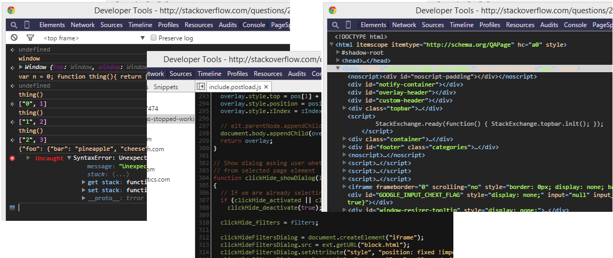

IR_Black + Base16 Dark DevTools Theme
================================

Port of [bentruyman's](https://github.com/bentruyman) IR_Black and [codemirror's](https://github.com/codemirror) Base16 Dark themes for Chrome Developer Tools using the experimental extension format.

* IR_Black Theme: [https://gist.github.com/bentruyman/1150520](https://gist.github.com/bentruyman/1150520)
* CodeMirror Base16: [https://github.com/codemirror/CodeMirror](https://github.com/codemirror/CodeMirror)
* Extension Help: [http://stackoverflow.com/a/21210882](http://stackoverflow.com/a/21210882)

## Install ##

1. go to `chrome://flags` and enable "Enable Developer Tools experiments."
2. restart Chrome
3. open Dev Tools, go to the Experiments tab off the cog menu and tick "Allow custom UI themes"
4. clone/download this repo
5. go to `chrome://extensions` and enable Developer Mode
6. click "Load unpacked extension..." and open the folder for this repo

## Customise ##

Just edit `Custom.css` and you should see the changes instantly - if not, go to `chrome://extensions` and reload this extension. You can even swap out the file for a completely different theme, if you want.

To change the theme used on the Sources panel you'll want to edit the `.cm-js-*` stuff at the bottom of `Custom.css`. If you replace it outright with an existing CodeMirror theme, make sure the theme name selectors (`.cm-s-*`) are changed to `.cm-s-default` or it won't work. Also not sure if every CSS rule needs an `!important` but it can't hurt, right?

## License ##

I went with BSD 3-Clause like I normally do, as it enforces that users and tweakers must acknowledge the original author(s). If bentruyman, codemirror, and/or rob-w (the guy who wrote the SO answer I used) see this and aren't happy with that license being used, let me know and I'll change it.
